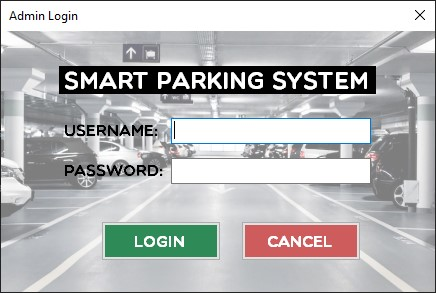
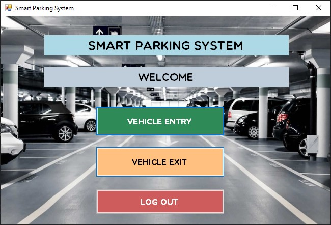
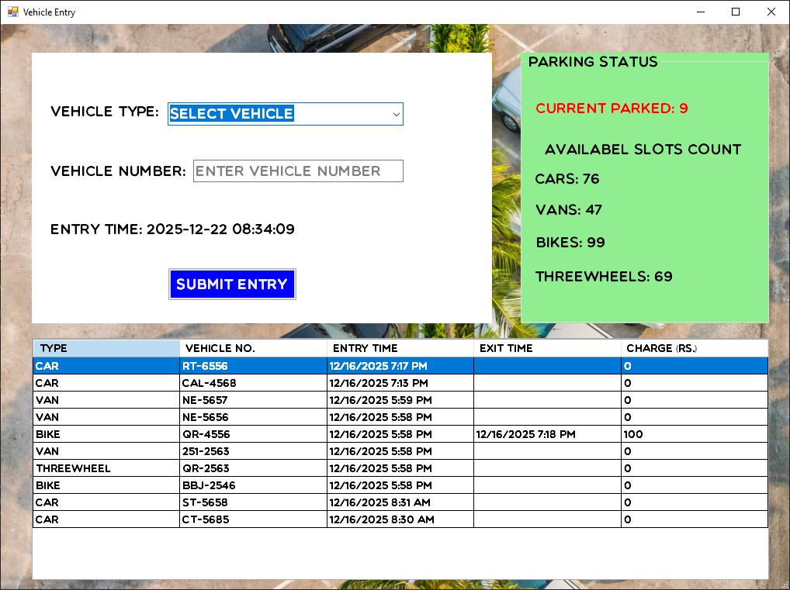
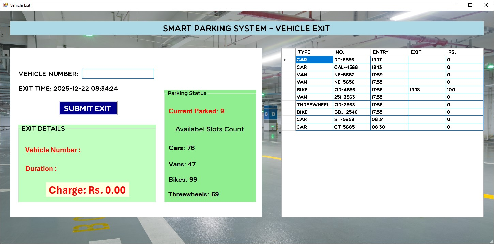

# Smart Parking System

## Project Overview

The **Smart Parking System** is a desktop-based application developed using **C# (.NET Framework WinForms)** with **MySQL database integration**.

This system is designed to automate and manage vehicle parking operations efficiently by handling vehicle entry, exit, slot allocation, and parking records in a structured digital environment.

The system improves traditional manual parking methods by reducing human error, improving speed, and maintaining accurate records of all vehicle activities.

---

## Objectives

- Automate vehicle parking management
- Track vehicle entry and exit times
- Manage parking slot availability efficiently
- Store and retrieve parking data using a database
- Provide a simple and user-friendly interface

---

## Technologies Used

- C# (.NET Framework 4.7.2)
- Windows Forms (WinForms)
- MySQL Database
- ADO.NET
- Visual Studio 2022

---

## System Modules

### Login Module
- Secure authentication for system access
- Only authorized users can enter the system

### Vehicle Entry Module
- Records incoming vehicles
- Assigns parking slots
- Stores entry time in database

### Vehicle Exit Module
- Records vehicle exit time
- Calculates parking duration
- Updates slot availability

### Parking Management Module
- Tracks available and occupied slots
- Real-time status updates

---

## System Screenshots

### 🔹 S1 - Login Screen

  

---

### 🔹 S2 - Main Dashboard

  

---

### 🔹 S3 - Vehicle Entry Form

  

---

### 🔹 S4 - Vehicle Exit Form

  

---
